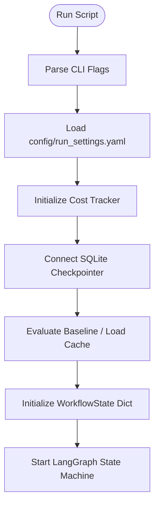

# Autonomous RAG Optimizer: Step-by-Step Overnight Run Guide

This guide breaks down exactly what happens when you run `python scripts/run_overnight.py` from scratch. We assume no prior knowledge of the codebase. You will learn the **why** (the purpose) and the **how** (the code mechanics) of every phase in the system.

---

## 1. High-Level Concept: What is this project doing?

Evaluating and optimizing RAG (Retrieval-Augmented Generation) is difficult because there are dozens of moving parts called **hyperparameters**:
* How large should our text chunks be? (`chunk_size`)
* How much overlap should they have? (`chunk_overlap`)
* Which embedding model is best? (`embedding_model`)
* Should we use vector search, keyword search, or a weighted hybrid of both? (`hybrid_alpha`)
* Should we use a reranker, and if so, which one? (`reranker`)

Instead of manually guessing or running expensive brute-force grid searches, this project uses a **scientific search loop** built on **LangGraph**. It acts as an autonomous scientist:
1. It proposes a hypothesis and config.
2. It validates, deduplicates, and indexes the corpus.
3. It evaluates retrieval performance on a test dataset (HotpotQA).
4. It accepts/rejects the config, writes results to a database, and reflects on what worked.
5. It uses reasoning LLMs to propose the next iteration based on past findings.

---

## 2. Phase 1: Booting up `run_overnight.py` (The Setup)

When you run `python scripts/run_overnight.py --max-exp 20 --max-hours 6`, the command-line entry point does the following:

### Step A: CLI and Settings Parsing
* **Why:** The system needs limits (hours, max experiments, budget ceilings) so it doesn't run indefinitely or cost too much.
* **How:** It uses the `click` library to parse command-line options. It loads global configurations (like api parameters) via `load_run_settings()`.

### Step B: Cost Tracker Initialization
* **Why:** To prevent accidental high bills if an API call gets stuck or loops.
* **How:** `cost_tracker.initialize()` sets a hard spend ceiling (e.g. $10.00) in-memory. Every API call reports its tokens, which increments this tracker.

### Step C: Resuming/Checkpointer Setup
* **Why:** If the internet drops or you press `Ctrl+C` to pause the run, you don't want to lose all progress and start from scratch.
* **How:** It connects to `experiments.sqlite` using LangGraph's `AsyncSqliteSaver`. This checkpointer saves the entire state after each node completes. If you run with `--resume`, it queries SQLite for the last active `run_id` and restores the exact state dictionary to pick up right where it stopped.

### Step D: Baseline Evaluation (Phase 0)
* **Why:** To evaluate optimizations, we need a baseline score to compare against.
* **How:** 
  1. It loads a default `baseline_config` (e.g., standard text-embedding-3-small, sentence splitter, chunk size 512, top_k 5, no reranker).
  2. It generates a hash of this baseline config. If it finds a match in `data/eval_cache/`, it retrieves the cached score to save money.
  3. If cache-missed, it runs a full evaluation against the HotpotQA test questions using `_evaluate_baseline()`.
  4. It returns a `weighted_score` (representing how accurately it retrieved gold paragraphs) and saves it as the starting score.

---

## 3. Phase 2: The LangGraph State Machine Loop

Once the graph compiles, it runs node-by-node. The state of the system is stored in a dictionary called `WorkflowState` (defined in [state.py](file:///d:/Documents/python/new%20life/autonomous%20rag/autonomous-rag/src/orchestrator/state.py)) and passed along.

Here is the step-by-step breakdown of every node in the Mermaid diagram:

### 1. Scientist Node (`scientist_node` in [brain.py](file:///d:/Documents/python/new%20life/autonomous%20rag/autonomous-rag/src/scientist/brain.py))
* **Why:** To propose the next experiment configuration based on logical reasoning.
* **How:**
  1. **Structured Exploration:** For the first few runs, it ignores the LLM and selects structured candidate configs (defined in [candidates.py](file:///d:/Documents/python/new%20life/autonomous%20rag/autonomous-rag/src/scientist/candidates.py)) to map out the search space.
  2. **Reranker Probes:** Periodically, it forces probe configs to test new rerankers.
  3. **LLM Propose:** If doing normal search, it builds a prompt containing:
     * System instructions (`prompts/scientist_v1.txt`).
     * The `current_best_config` and its `weighted_score`.
     * A history of what was `ACCEPTED` or `REJECTED` previously.
     * The `reflection_summary` (distilled rules of what works).
     * It calls `deepseek/deepseek-v4-pro` with reasoning enabled (`reasoning_effort="high"`).
     * The model outputs a JSON string containing the new `proposed_config` and a `hypothesis` (e.g. *"Adding a Cohere Reranker will clean up noise and improve MRR"*).

### 2. Validator Node (`validator_node` in [validator.py](file:///d:/Documents/python/new%20life/autonomous%20rag/autonomous-rag/src/orchestrator/validator.py))
* **Why:** LLMs might hallucinate invalid parameters (e.g., negative overlaps, non-existent models) or suggest options disabled in settings.
* **How:**
  1. It tries to instantiate a Pydantic `RAGConfig` model using the proposed config.
  2. It checks against constraints (e.g., checks if a new index build is required but disabled).
  3. If validation fails, it sets `status = FAILED_VALIDATION` and routes to `recorder`. Otherwise, it outputs `validated_config` and continues.

### 3. Deduplicator Node (`deduplicator_node` in [deduplicator.py](file:///d:/Documents/python/new%20life/autonomous%20rag/autonomous-rag/src/scientist/deduplicator.py))
* **Why:** Evaluating a configuration is the most expensive and slowest step. If the LLM proposes an identical config that we already ran, we must skip it.
* **How:**
  1. It computes a cryptographic hash of the logical keys in the configuration.
  2. It queries SQLite. If the hash exists in the `experiments` database, it updates `status = FAILED_DUPLICATE` and shortcuts directly to `recorder`.

### 4. Budget Guard Node (`budget_guard_node` in [budget_guard.py](file:///d:/Documents/python/new%20life/autonomous%20rag/autonomous-rag/src/orchestrator/budget_guard.py))
* **Why:** To enforce strict spend limits.
* **How:**
  1. It checks the cost tracker for cumulative run cost.
  2. If the limit is breached, it updates `status = BUDGET_EXCEEDED` and redirects immediately to the `report_writer` to end the execution.

### 5. Indexer Node (`indexer_node` in [collection_manager.py](file:///d:/Documents/python/new%20life/autonomous%20rag/autonomous-rag/src/indexer/collection_manager.py))
* **Why:** If the scientist changed chunking parameters (e.g. chunk size) or the embedding model, we must parse and index the text corpus.
* **How:**
  1. It generates a unique index name on disk based on the parameters.
  2. **Cache Hit:** If vectors exist at `data/chroma/` and BM25 pickle data exists at `data/bm25/`, it skips building and reuses them.
  3. **Cache Miss:** If not cached, it loads the HotpotQA text paragraphs, splits them using the node parser (e.g., sentence splitter), embeds them using the selected embedding model, and saves the vectors in ChromaDB. It also builds and pickles a BM25 index on disk.

### 6. Smoke Test Node (`smoke_test_node` in [smoke_tester.py](file:///d:/Documents/python/new%20life/autonomous%20rag/autonomous-rag/src/rag_pipeline/smoke_tester.py))
* **Why:** RAG evaluations are slow. If a configuration has a simple bug (e.g. misspelled reranker name), it will crash. We catch this immediately before starting the full test.
* **How:** It runs retrieval on 5 questions. If it times out or returns empty contexts, it marks `status = FAILED_SMOKE` and skips straight to `recorder`.

### 7. Evaluator Node (`evaluator_node` in [ragas_runner.py](file:///d:/Documents/python/new%20life/autonomous%20rag/autonomous-rag/src/evaluator/ragas_runner.py))
* **Why:** To measure the retrieval quality of the config against the ground truth.
* **How:**
  1. It runs the retrieval pipeline 3 times across a set of HotpotQA questions (default 20, or a larger full suite every 5 runs).
  2. For each query:
     * It builds a hybrid retriever (combines vector search cosine scores and BM25 scores).
     * It runs the reranker (e.g. Cohere or OpenRouter-based rerankers) to re-order the documents.
  3. It calculates **IR Metrics** (Recall@K, Precision@K, NDCG, MRR) by verifying if the retrieved text chunks contain the gold supporting facts from HotpotQA.
  4. Periodically, it runs **RAGAS Evaluation**:
     * It sends the retrieved contexts, questions, and ground truths to a judge LLM (`qwen/qwen3.5-flash-02-23` via OpenRouter).
     * The judge LLM rates qualitative metrics like **faithfulness** (lack of hallucinations) and **context recall**.
  5. It computes the final **proposed_weighted_score** (the optimization metric).

### 8. Acceptance Node (`acceptance_node` in [scorer.py](file:///d:/Documents/python/new%20life/autonomous%20rag/autonomous-rag/src/evaluator/scorer.py))
* **Why:** To decide if the new score beats the current record.
* **How:** It evaluates the results against rules in `run_settings.yaml`:
  * Does the new score beat the previous record by a minimum margin (e.g., +0.5%)?
  * **Variance check:** If the variance between the 3 runs is too high, it rejects it as unstable.
  * **Recall regression check:** If recall dropped significantly (even if weighted score is higher due to other metrics), it rejects it to preserve RAG quality.
  * Sets status to `ACCEPTED` (updates current best) or `REJECTED`/`COMPETITIVE`.

### 9. Recorder Node (`recorder_node` in [experiment_log.py](file:///d:/Documents/python/new%20life/autonomous%20rag/autonomous-rag/src/storage/experiment_log.py))
* **Why:** Logs all data for the next scientist node prompts and user reviews.
* **How:** It inserts a row into the SQLite `experiments` table with the config, hypothesis, status, scores, costs, and timings.

### 10. Router (Conditional transition)
* **Why:** To decide if we should stop the run or start another experiment.
* **How:**
  * If elapsed time exceeds `max_hours`, or experiments completed exceeds `max_exp`, or consecutive crashes exceed the limit -> Routes to `report_writer`.
  * Otherwise -> Routes to `reflection`.

### 11. Reflection Node (`reflection_node` in [reflection.py](file:///d:/Documents/python/new%20life/autonomous%20rag/autonomous-rag/src/scientist/reflection.py))
* **Why:** Distills history. Over time, the history of 20+ runs is too long for the Scientist LLM's context window. We need a summary of lessons learned.
* **How:** Every 3 runs, it asks `deepseek/deepseek-v4-pro` to review the accepted and rejected configs and output 5-8 bulleted rules. This summary is updated in the state dictionary and passed to the next **Scientist Node** invocation.

### 12. Report Writer Node (`report_writer_node` in [report_writer.py](file:///d:/Documents/python/new%20life/autonomous%20rag/autonomous-rag/src/reporter/report_writer.py))
* **Why:** Formats a report for you to read in the morning.
* **How:** It extracts the final best config and its metrics, prompts `deepseek/deepseek-v4-pro` to write a summary, and writes it to `reports/overnight_run_report.md`.

---

## 4. Why this architecture was chosen

1. **State Isolation:** Because each node is a pure function that takes a state dictionary and outputs modifications, it is very clean to unit test individual nodes (e.g. testing the `validator` or `deduplicator` in isolation).
2. **Crash Resilience:** If the machine goes to sleep, the process is killed, or you run out of API credits, you can fix the issue and resume. The SQLite checkpointer saves state at every single step, meaning you don't lose hours of evaluations.
3. **Budget Guardrails:** By separating validation, deduplication, and budget checking into nodes that run *before* index building and evaluation, the system avoids spending API money on bad configurations.
4. **Self-Correction (Reflection):** By using a reasoning model to analyze why past configurations failed, the search query evolves intelligently instead of drifting randomly.
