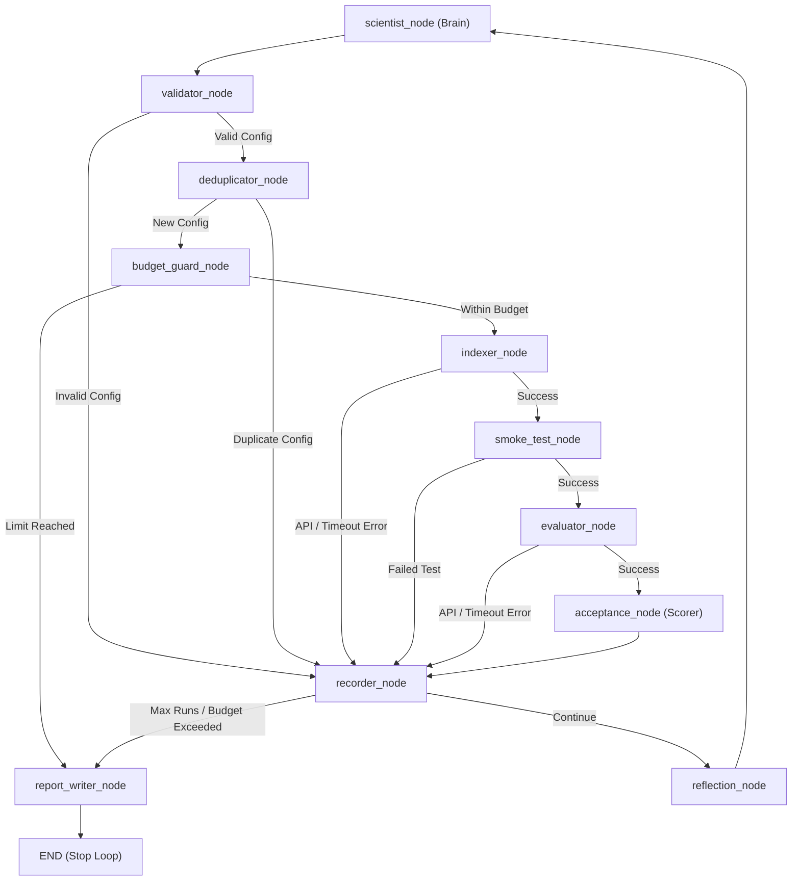

2# Autonomous RAG Project Architecture Breakdown

This document provides a detailed breakdown of the classes, objects, protocols, and workflows within the **Autonomous RAG** repository.


## 1. Project Overview

The **Autonomous RAG Optimizer** is an agentic evaluation framework designed to automatically search for, build, and evaluate the best Retrieval-Augmented Generation (RAG) pipeline configurations.
It uses **LangGraph** to manage a state machine (the "Scientist" loop) that iteratively proposes new search configurations (hyperparameters), splits and indexes a corpus, runs smoke tests, evaluates the pipeline using information retrieval (IR) and Ragas metrics, and updates a SQLite database of historical experiments.




## 2. Core Class & Object Breakdown

### Component 2.1: Abstractions & Dependency Injection (`src/core`)
To enable testability and decoupling from cloud APIs, the system defines Python protocols (interfaces) and a dependency injection container.

*   **`ICostTracker` (Protocol)**: 
    Defines the contract for tracking API costs.
    *   *Methods*: `initialize()`, `add_cost()`, `get_total()`.
*   **`ILLMClient` (Protocol)**: 
    Defines the contract for interacting with Language Models.
    *   *Methods*: `call()`.
*   **`IEmbeddingService` (Protocol)**: 
    Provides text and query embedding capabilities.
    *   *Methods*: `embed_texts()`, `embed_query()`, `get_llama_index_embedding()`.
*   **`IDatabase` (Protocol)**: 
    Provides raw database connectivity.
    *   *Methods*: `init()`, `connect()`.
*   **`IChromaClientFactory` (Protocol)**: 
    Instantiates Chroma vector database clients.
    *   *Methods*: `get_client()`, `path()`.
*   **`IRagasFactory` (Protocol)**: 
    Wires up LLMs and embeddings specifically for the Ragas evaluator.
    *   *Methods*: `build_llm()`, `build_embeddings()`, `build_metrics()`.
*   **`IModelRoutingProvider` (Protocol)**: 
    Determines model IDs and configs by role (e.g., generator, scientist, evaluator).
    *   *Methods*: `get_model_id()`, `get_config()`.
*   **`Provider` (Class)**: 
    A central DI container that holds references to implementations of the above protocols. All node functions access external resources through this provider.

### Component 2.2: Config & Metrics Models (`src/models`)
These are strongly-typed Pydantic schemas that represent system states, parameters, and results.

*   **`RAGConfig` (BaseModel)**: 
    Defines the search space parameters for a single RAG pipeline:
    *   *Fields*: `chunk_size`, `chunk_overlap`, `top_k`, `hybrid_alpha`, `embedding_model`, `node_parser`, `retriever`, `reranker`, `reranker_top_n`, `generator_model`, etc.
    *   *Validators*: Enforces logical relations (e.g., `reranker_top_n` must be less than `top_k`, and is only allowed if `reranker` is specified).
*   **`SingleRunMetrics` (BaseModel)**: 
    Represents metrics calculated for a single evaluation pass:
    *   *Fields*: `faithfulness`, `answer_relevancy`, `context_recall`, `context_precision`, `context_utilization`, `recall_at_k`, `precision_at_k`, `ndcg_at_k`, `mrr`.
    *   *Properties*: `weighted_score` (a weighted linear combination of IR metrics and context recall).
*   **`AggregatedMetrics` (BaseModel)**: 
    Combines up to three distinct evaluation runs to smooth out LLM variance.
    *   *Fields*: `run_1`, `run_2`, `run_3`, and median values for all primary metrics, plus `std_dev_weighted_score` (standard deviation).
    *   *Methods*: `from_runs()`.
*   **`ExperimentRecord` (BaseModel)**: 
    The fully documented record of a RAG pipeline experiment stored in the database.
    *   *Fields*: `experiment_id`, `experiment_uuid`, `config` (`RAGConfig`), `config_hash`, `hypothesis`, `reflection_summary`, `metrics` (`AggregatedMetrics`), `baseline_weighted_score`, `status` (`ACCEPTED`, `REJECTED`, `FAILED_SMOKE`, etc.), `cost_usd`, `started_at`, `finished_at`.

### Component 2.3: Storage & Repositories (`src/storage`)
Handles state persistence to a local SQLite database configured in WAL mode.

*   **`Database` (Class)**: 
    Initializes SQLite with asynchronous `aiosqlite` connection management. Builds tables: `experiments`, `config_hashes`, and `runs`.
*   **`ExperimentRepository` (Class)**: 
    Encapsulates database inserts and reads for `ExperimentRecord` entities.
*   **`ConfigHashRepository` (Class)**: 
    Manages uniqueness constraint caches. Keeps track of already executed configurations and their scores to prevent duplicate runs.
*   **`RunRepository` (Class)**: 
    Tracks the metadata of the overall optimization run (cost, count of experiments, status).

### Component 2.4: Scientist Brain (`src/scientist`)
Executes the hypothesis-generation phase.

*   **`scientist_node` (Workflow Node Function)**: 
    Computes a compressed summary of experiment history and chooses whether to execute:
    1.  *Structured Exploration*: Systematic sweeping of the initial parameter space.
    2.  *Reranker Probing*: Targeted experiments enforcing a reranker step to verify performance changes.
    3.  *LLM Proposal*: DeepSeek-V4 model generates a new hyperparameter config and explanation hypothesis based on historical wins and losses.
*   **`reflection_node` (Workflow Node Function)**: 
    Triggers an LLM call periodically to synthesize the results of recent configurations and construct actionable feedback for the next scientist node.

### Component 2.5: Indexing and Search Space (`src/indexer`)
Prepares vector databases and sparse search indices.

*   **`indexer_node` (Workflow Node Function)**: 
    Manages high-level caching. If the current `RAGConfig`'s node-parser configuration is already indexed, it retrieves the cached Chroma collection name; otherwise, it builds a new index.
*   **`index_builder.py`**: 
    Extracts text from paragraphs, splits it into nodes via the selected parser, creates a BM25 index serialized to `pickle`, embeds the text chunks, and uploads the results into **ChromaDB**.
*   **`parser_registry.py`**: 
    A factory mapping configuration strings to LlamaIndex node splitters (e.g. `SentenceSplitter`, `SemanticSplitter`, `SentenceWindowNodeParser`, or `HierarchicalNodeParser`).

### Component 2.6: RAG Execution (`src/rag_pipeline`)
Runs retrieval and generation on the active configuration.

*   **`retriever.py`**: 
    Builds the active LlamaIndex retriever. Implements custom retriever wrapper classes:
    *   `WeightedHybridRetriever`: Integrates dense Chroma vector query outputs with sparse BM25 scores using Reciprocal Rank Fusion (RRF).
    *   `RerankingRetriever`: Wraps a base retriever and applies a postprocessing step (e.g. Cohere Rerank) to select the top $N$ documents.
*   **`generator.py`**: 
    Synthesizes answers for retrieval results using models like DeepSeek or Qwen.

### Component 2.7: Evaluation & Guardrails (`src/evaluator` & `src/orchestrator`)
Calculates success metrics and protects resource limits.

*   **`evaluator_node` (Workflow Node Function)**: 
    Executes IR and LLM-as-a-judge metric calculations using the Ragas framework.
*   **`acceptance_node` (Workflow Node Function)**: 
    Applies acceptance constraints:
    *   Checks if the proposed weighted score beats the baseline.
    *   Guards against high variance across runs.
    *   Rejects configs that register regression on primary IR metrics (`recall_at_k`, `ndcg_at_k`, `mrr`).
*   **`budget_guard_node` (Workflow Node Function)**: 
    Inspects cumulative overnight run costs and terminates the pipeline if limits are hit.

---

## 3. Global Project Class Diagram

The class diagram below displays the relationships between structural classes, protocols, and data models.

```mermaid
classDiagram
    direction TB

    %% core Interface Protocols
    class ICostTracker {
        <<interface>>
        +initialize(hard_ceiling, warning_threshold, start_cost) None
        +add_cost(usd) float
        +get_total() float
    }
    class ILLMClient {
        <<interface>>
        +call(model_id, messages, max_tokens, task, ...) str
    }
    class IEmbeddingService {
        <<interface>>
        +embed_texts(texts) list
        +embed_query(query) list
        +get_llama_index_embedding(model_name) Any
    }
    class IDatabase {
        <<interface>>
        +init() None
        +connect() Any
    }
    
    %% Dependency Injection Container
    class Provider {
        +cost_tracker: ICostTracker
        +llm_client: ILLMClient
        +embedding_service: IEmbeddingService
        +database: IDatabase
        +chroma_factory: IChromaClientFactory
        +ragas_factory: IRagasFactory
        +model_routing_provider: IModelRoutingProvider
        +settings: Any
    }

    %% Data Models
    class RAGConfig {
        +chunk_size: int
        +chunk_overlap: int
        +top_k: int
        +hybrid_alpha: float
        +embedding_model: str
        +node_parser: str
        +retriever: str
        +window_size: int
        +semantic_threshold: int
        +semantic_buffer_size: int
        +fusion_mode: str
        +fusion_num_queries: int
        +reranker: str
        +reranker_top_n: int
        +generator_model: str
        +validate_node_parser()
        +validate_retriever()
    }
    
    class SingleRunMetrics {
        +faithfulness: float
        +answer_relevancy: float
        +context_recall: float
        +context_precision: float
        +context_utilization: float
        +recall_at_k: float
        +precision_at_k: float
        +ndcg_at_k: float
        +mrr: float
        +weighted_score: float
    }

    class AggregatedMetrics {
        +run_1: SingleRunMetrics
        +run_2: SingleRunMetrics
        +run_3: SingleRunMetrics
        +median_weighted_score: float
        +std_dev_weighted_score: float
        +from_runs(runs) AggregatedMetrics
    }

    class ExperimentRecord {
        +experiment_id: int
        +experiment_uuid: str
        +config: RAGConfig
        +config_hash: str
        +hypothesis: str
        +reflection_summary: str
        +metrics: AggregatedMetrics
        +baseline_weighted_score: float
        +status: str
        +cost_usd: float
        +started_at: datetime
        +finished_at: datetime
    }

    %% Retrievers
    class WeightedHybridRetriever {
        +dense_retriever: BaseRetriever
        +bm25_retriever: BaseRetriever
        +alpha: float
        +top_k: int
        +_fuse(dense_nodes, bm25_nodes)
        +retrieve(query)
    }

    class RerankingRetriever {
        +base_retriever: BaseRetriever
        +reranker: CohereRerank
        +retrieve(query)
    }

    %% DB Persistence
    class Database {
        +path: str
        +init()
        +connect()
    }
    class ExperimentRepository {
        -db: aiosqlite.Connection
        +insert(experiment)
        +find_used_hashes()
    }

    %% Dependency & Aggregation Associations
    Provider --> ICostTracker : dependency
    Provider --> ILLMClient : dependency
    Provider --> IEmbeddingService : dependency
    Provider --> IDatabase : dependency

    ExperimentRecord --> RAGConfig : aggregates
    ExperimentRecord --> AggregatedMetrics : aggregates
    AggregatedMetrics --> SingleRunMetrics : aggregates
    
    Database ..|> IDatabase : implements
    ExperimentRepository --> Database : executes on
    
    WeightedHybridRetriever --|> LlamaIndex_BaseRetriever : inherits
    RerankingRetriever --|> LlamaIndex_BaseRetriever : inherits
